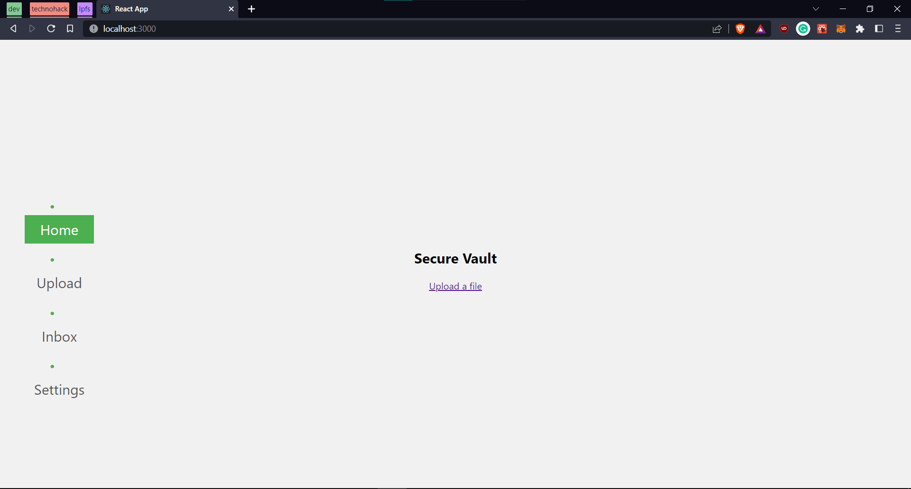

SecVault
============

SecVault is a project for securely storing and sharing sensitive PII (Personal Identifiable Information) data of citizens. The project implements robust security measures such as encryption and two-factor authentication, and provides a convenient way for citizens to securely access their PII data and share with authorized third-party organizations.

Features
--------

-   Securely store and manage sensitive PII data
-   Implement robust security measures such as encryption and two-factor authentication
-   Provide a convenient way for citizens to securely share their PII data
-   option to share access of files with a time limit with authorized third-party organizations in a secure environment

Screenshots
-----------



Demo Video
----------

https://www.loom.com/share/4a5086a01fc74f9db59064106f72b14f

## Installation
* Add [Metamask Extension](https://chrome.google.com/webstore/detail/metamask/nkbihfbeogaeaoehlefnkodbefgpgknn?hl=en)
* Clone the Repository
```
$ git clone https://github.com/aakash414/securevault.git
```
* Install Dependencies
* Run the Terminal, In root directory:
 ```
 npm install
 npm start
 ```
------------

## Roadmap

- [x] Add Metamask Authentication
- [x] Implement Uploading 
- [x] Using IPFS for decentralized storage
- [x] Implement private and secure File Sharing feature(Bug fixing)
- [ ] Time limited File Sharing
  

Tech Stack
----------

-   React.js (Frontend)
-   Node.js (Backend)
-   Solidity (Smart Contracts)
-   IPFS (Decentralized storage and sharding)
-   Metamask (Authentication)

## License

Distributed under the MIT License. See `LICENSE.txt` for more information.

API Used
--------

-   MetaMask API

## Team Members
-   [Aazim Anish](https://github.com/AazimAnish) 
-   [Aakash P R](https://github.com/aakash414)
